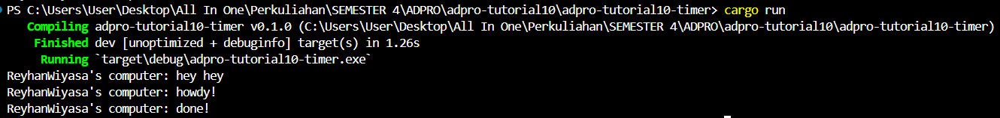
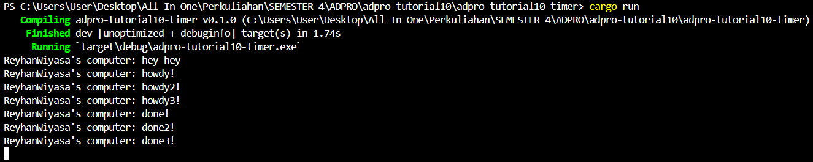

1.2 Understanding how it works

Terlihat bahwa fungsi async akan dieksekusi di luar fungsi utama yang memanggilnya. Program akan melanjutkan eksekusi dan mencetak "hey hey", sedangkan fungsi async masih menunggu hasil dari future. Hasilnya adalah output "hey hey" muncul sebelum "howdy" dan "done" karena "hey hey" berada di luar fungsi async.

1.3 Multiple spawn and removing drop

Terlihat bahwa banyak spawner menghasilkan peningkatan jumlah tugas yang dilakukan karena pengirim tugas memiliki jumlah tugas yang lebih banyak seperti antrian pesan. Dengan melakukan drop spawner, maka menyebabkan program tidak berhenti walaupun spawner sudah selesai karena dianggap masih akan ada pengiriman data oleh spawner.
